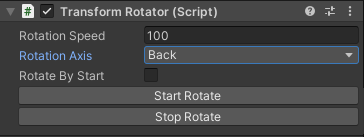

# Transform Rotator

Simple transform rotator for any Unity GameObject

## How To Get Started

* Download .unitypackage and install it to your project
* Attach sctipt TransformRotator to any GameObject
* Customize it 
 
 
 Works in Edit Mode
